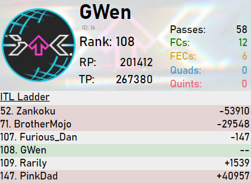
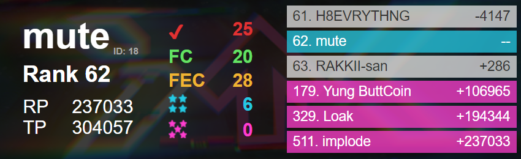
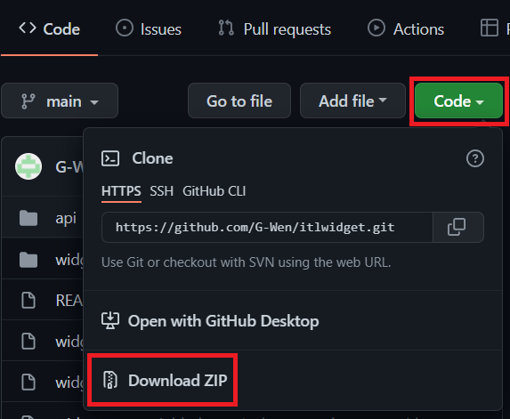

# itlwidget
Streamer widget and API for [ITL Online 2022](https://itl2022.groovestats.com).

To download the repository you can click on `Code` and then `Download ZIP`:

You do not need the `api` folder if you are only planning on using the widget. 

To run the widget download the repository and follow the instructions in `widget/readme.txt`.

Dark theme of the widget was provided courtesy of [Freis](https://github.com/gab-santi), minor modifications have been made.

mute's theme of the widget was provided courtesy of [mutesauce](https://github.com/mutesauce).

VincentITG has created a [reimplementation in Typescript](https://github.com/vlnguyen/itl-stream-widget).
