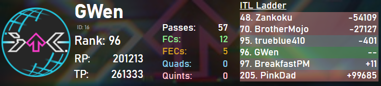
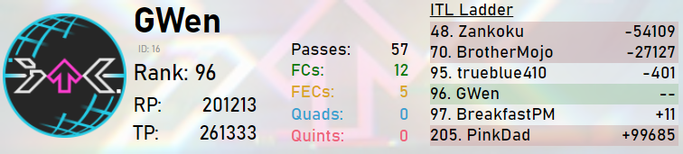

# itlwidget
Streamer widget and API for [ITL Online 2022](https://itl2022.groovestats.com).

To run the widget download the repository and follow the instructions in `widget/readme.txt`.

The dark theme of the widget was provided by Freis, minor modifications have been made. 

VincentITG has created a [reimplementation in Typescript](https://github.com/vlnguyen/itl-stream-widget).
